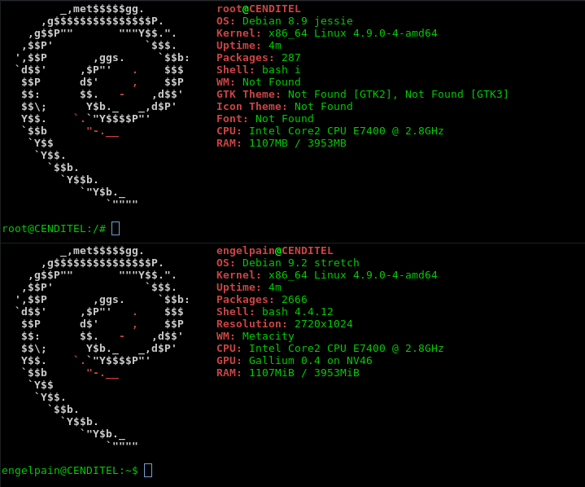
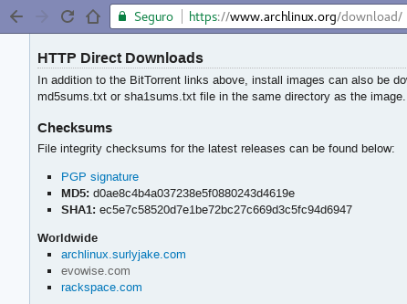
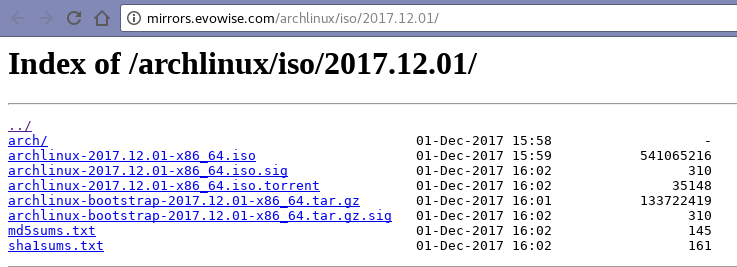
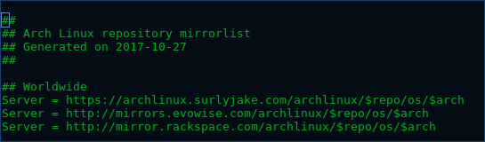
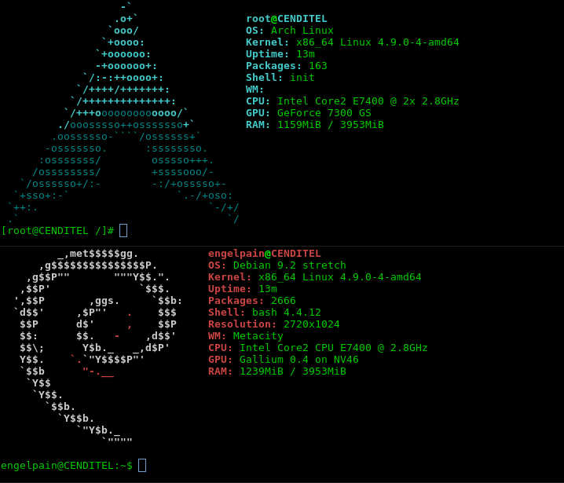

## Guía de elaboración de sistemas enjaulados en Debian
Centro Nacional de Desarrollo e Investigación de Tecnologías Libres (CENDITEL)<br/>
CENDITEL, Mérida - Venezuela <br/>
Dirección de Desarrollo <br/>
Autor: Ing. [Angelo Osorio](https://twitter.com/Engel_PAIN) <br/>
Fecha de Elaboración: 05-12-2017 (dd,mm,aaaa)<br/>

### Notas del autor
El símbolo al principio de una línea de comandos indica:
```
  $ = hacer la sentencia como usuario
  # = hacer la sentencia como administrador
```

## ¿Qué es un sistema enjaulado?
También denominado **Bootstraping**, consiste en correr un sistema operativo invitado dentro de un 
anfitrión, a través de la consola.
Sirven para hacer pruebas en distintas distribuciones sin la necesidad de utilizar una máquina 
virtual, ni interfaz gráfica, además que utiliza los requerimientos de la máquina anfitriona, en 
lugar de seccionar éstos como pasa al momento de instalar una máquina virtual. La única desventaja 
es que toda operación dentro de la jaula se realizará bajo permiso root exclusivamente.
Son útiles cuando se requiere probar versiones de programas que tienen dependencias específicas.

## Crear una jaula de Debian 8 (jessie) en Debian 9 (stretch)
1. Instalar debootstrap:
   * `# apt install debootstrap`
2. Crear un directorio (con un nombre descriptivo) para el sistema enjaulado:
   * `# mkdir -p /jaulas/jessie`
   * **Nota:** En este caso se creó un directorio que se llama `jaulas` antes de crear el 
   directorio `jessie` que será el que alojará la jaula, dado que es más práctico tener todas las 
   jaulas en el mismo sitio.
   * **Nota 2:** Es indiferente dónde se cree el directorio, siempre y cuando se tenga en cuenta que 
   la ruta cambiará dependiendo de dónde se guarde. En este ejemplo, el directorio está directamente 
   en la raíz, entonces, el prefijo de la dirección siempre será `/`.
   * **Nota 3:** Se utiliza el argumento `-p` para que no arroje un error si el directorio padre ya 
   existe y crea el directorio padre si es necesario.
3. Descargar el sistema desde los repositorios Debian
   * `# debootstrap jessie /jaulas/jessie ​http://ftp.us.debian.org/debian/`
4. Una vez descargado se debe importar el `proc` de la máquina anfitrión a la jaula.
   * `# mount -t proc proc /jaulas/jessie/proc`
   * **Nota:** Cada vez que se reinicia el equipo hay que montar el `proc`, para automatizar este
   paso y que sea montado cada vez que se inicie el equipo se puede modificar el fichero 
   `/etc/fstab` con la siguiente instrucción:
      * `# echo "/proc /jaulas/jessie/proc/ auto bind 0 0 " >> /etc/fstab`
      * Y al iniciar el sistema anfitrión, se utiliza solo el comando:
         * `# mount -a`
5. Entrar en la jaula:
   * `# chroot /jaulas/jessie`

Ahora la jaula está lista para utilizar.
 <br>


## Crear una jaula de Arch Linux en Debian 9
>Arch Linux está disponible sólo para 64 Bits.

1. Crear un directorio para el sistema enjaulado:
   * `# mkdir -p /jaulas/arch`
   * **Nota:** En este caso se creó un directorio que se llama `jaulas` antes de crear el 
   directorio `jessie` que será el que alojará la jaula, dado que es más práctico tener todas las 
   jaulas en el mismo sitio.
   * **Nota 2:** Es indiferente dónde se cree el directorio, siempre y cuando se tenga en cuenta que 
   la ruta cambiará dependiendo de dónde se guarde. En este ejemplo, el directorio está directamente 
   en la raíz, entonces, el prefijo de la dirección siempre será `/`.
   * **Nota 3:** Se utiliza el argumento `-p` para que no arroje un error si el directorio padre ya 
   existe y crea el directorio padre si es necesario.
2. Descargar la imagen Bootstrap desde un servidor de réplica con el navegador:
   1. Entrar en la página oficial de descargas de [Arch Linux](https://www.archlinux.org/download/)
   2. Elegir un repositorio del apartado **HTTP Direct Downloads**
   
   3. Elegir el repositorio de su preferencia, en este caso se eligió:
   [evowise.com](http://mirrors.evowise.com/archlinux/iso/)
   4. Buscar la imagen más reciente en el repositorio
    <br>
   
   5.  Descargar la imagen bootstrap desde la consola
      * `# cd /jaulas/arch`
      * `# wget http://mirrors.evowise.com/archlinux/iso/2017.12.01/archlinux-bootstrap-2017.12.01-x86_64.tar.gz`
3. Descomprimir lo descargado
   * `# tar xzf archlinux-bootstrap-2017.12.01-x86_64.tar.gz`
4. Modificar el archivo de repositorios de la jaula
   * `# nano root.x86_64/etc/pacman.d/mirrorlist`
   * Se mostrará una lista de repositorios, se debe eliminar el signo **#** al principio de la línea 
   del o los repositorio de su preferencia.
   * En este caso se desmarcaron los tres de la Worldwide:
      * 
5. Entrar en la jaula
   * `# /jaulas/arch/root.x86_64/bin/arch-chroot /jaulas/arch/root.x86_64/` 
6.Iniciar las llaves de Pacman
   * `# pacman-key --init`
   * `# pacman-key --populate archlinux`

Ahora la jaula está lista para utilizar <br>


### Enlaces de referencia:

[Guía de referencia para Jaula de Debian](https://cumaco.cenditel.gob.ve/desarrollo/wiki/openwrt)<br>
[Guía de referencia para Jaula de Arch](https://wiki.archlinux.org/index.php/Install_from_existing_Linux_(Espa%C3%B1ol))