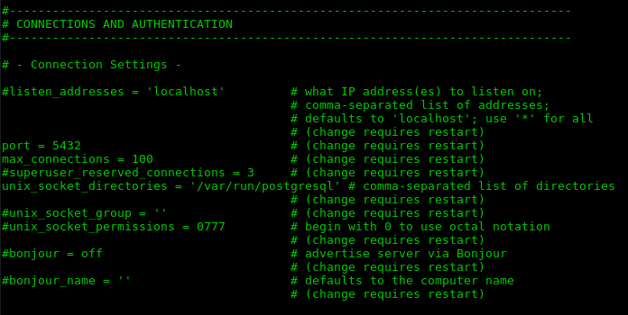
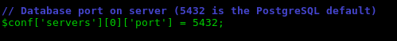

<h1> Ubicación de puertos de programas </h1>

 Centro Nacional de Desarrollo e Investigación de Tecnologías Libres (CENDITEL)

 CENDITEL, Mérida - Venezuela 

 Dirección de Desarrollo 

 Autor: <a href="https://twitter.com/Engel_PAIN">Ing. Angelo Osorio</a> 

 Fecha de Elaboración: 05-12-2017 (dd,mm,aaaa)

<h2>Notas del autor</h2>

El símbolo al principio de una línea de comandos indica:  
  <code>  $ = hacer la sentencia como usuario </code>  
  <code>  # = hacer la sentencia como administrador</code>

Nano es el editor de texto de consolas que instalar Debian por defecto, por ello se utiliza nano, sin embargo, se puede usar cualquier otro editor.

<h2>Apache</h2>
<ol>
  <li>El archivo de los puertos de apache  
    <code>  # nano /etc/apache2/ports.conf</code>
  </li>
  <li>
    
Entre las primeras líneas se encuentra una sentencia que dice <b>Listen 80</b>

    

    
Ese es el puerto (Por defecto es el 80)

  </li>
</ol>

<h2>PostgreSQL</h2>
<ol>
  <li>Abrir el archivo de configuración de PostgreSQL  
    <code>  $ nano /etc/postgresql/version/main/postgresql.conf</code>
    <i>Nota</i>: en <b>version</b> hay que reemplazarlo por la versión de PostgreSQL que posea, por ejemplo:  
    <code>  $ nano /etc/postgresql/9.4/main/postgresql.conf</code>
  </li>
  <li>
    
En el apartado CONNECTIONS AND AUTHENTICATION se encuentra el puerto (Por defecto es el 5432):

    

  </li>
</ol>

<h2>Phppgadmin</h2>
<ol>
  <li>
    
Abrir el archivo de configuración de Phppgadmin

    
<code>  # nano /etc/phppgadmin/config.inc.php</code>

  </li>
  <li>
    
Bajo el comentario "Database port on server (5432 is the PostgreSQL default)" está el puerto:

    

  </li>
</ol>