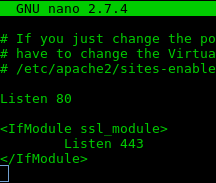

<h1> Ubicación de puertos de programas </h1>

 Centro Nacional de Desarrollo e Investigación de Tecnologías Libres (CENDITEL)

 CENDITEL, Mérida - Venezuela 

 Dirección de Desarrollo 

 Autor: <a href="https://twitter.com/Engel_PAIN">Ing. Angelo Osorio</a> 

 Fecha de Elaboración: 05-12-2017 (dd,mm,aaaa)
 

<h2>Notas del autor</h2>

El símbolo al principio de una línea de comandos indica:  
  <code> $ = hacer la sentencia como usuario </code>  
  <code> # = hacer la sentencia como administrador</code>

Nano es el editor de texto de consolas que instalar Debian por defecto, por ello se utiliza nano,
sin embargo, se puede usar cualquier otro editor.

<h2>Apache</h2>
<ol>
  <li>El archivo de los puertos de apache  
    <code> # nano /etc/apache2/ports.conf</code>
  </li>
  <li>
    
    
Entre las primeras líneas se encuentra una sentencia que dice <strong>Listen 80</strong>, ese es el puerto

    
El puerto por defecto de apache es el 80

  </li>
</ol>